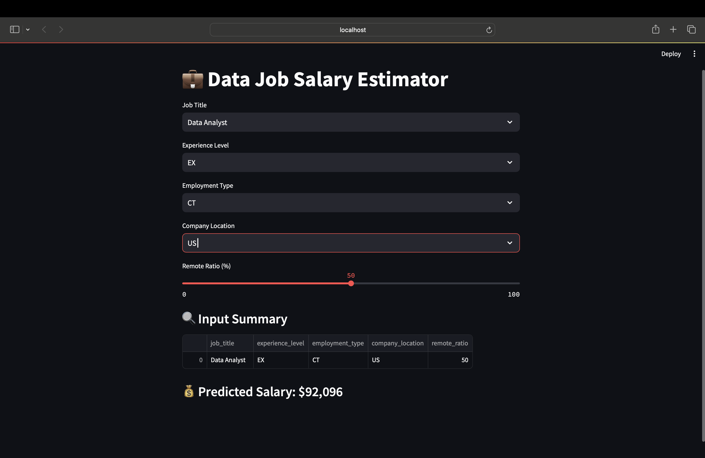

# 💼 Data Job Salary Estimator

A sleek and interactive web app that predicts salaries for data-related roles based on job title, experience level, company location, employment type, and remote ratio.

Built with 💖 using Python, Streamlit, and Machine Learning.

---

## 🚀 Live Demo (Optional)
> _Deploy this app to [Streamlit Cloud](https://streamlit.io/cloud) and paste your live link here._

---

## 🧠 What This Project Does

This project:
- Uses real-world job salary data
- Trains a machine learning model to estimate salaries
- Provides an easy-to-use interface for salary prediction
- Helps users understand the impact of location, role, and remote work

---

## 📸 Demo Screenshot

 

---

## 🧰 Tech Stack

| Tool        | Role                          |
|-------------|-------------------------------|
| `Python`    | Programming language          |
| `Pandas`    | Data cleaning & analysis      |
| `scikit-learn` | ML pipeline & model        |
| `joblib`    | Save/load model               |
| `Streamlit` | Web app framework             |

---

## 📁 Project Structure

```bash
data-salary-dashboard/
│
├── app.py                # Streamlit web app
├── train_model.py        # Model training script
├── salary_model.pkl      # Saved ML model
├── ds_salaries.csv       # Dataset (if not private)
├── requirements.txt      # Dependencies
└── README.md             # You’re reading this!

